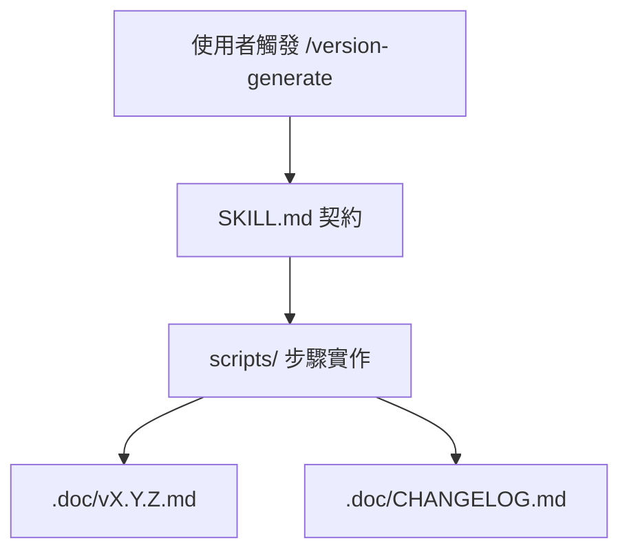

> [!NOTE]
> 此 README 由 [SKILL](https://github.com/pardnchiu/skill-readme-generate) 生成，英文版請參閱 [這裡](../README.md)。

***

<strong>STRUCTURED CHANGELOGS WITH SEMVER AUTOMATION AND TRACEABILITY!</strong>

***

> Claude Code 技能，產生結構化雙語 changelog，支援 SemVer 自動計算、Conventional Commits 解析與發版可追溯性

## 目錄

- [功能特點](#功能特點)
- [技術堆疊](#技術堆疊)
- [架構](#架構)
- [授權](#授權)

## 功能特點

> `git clone https://github.com/pardnchiu/skill-version-generate ~/.claude/skills/version-generate` · [完整文件](./doc.zh.md)

- **SemVer 自動計算** — 依 BREAKING > FEAT > PATCH 標籤優先權自動決定下一個版本號。
- **Conventional Commits 優先** — 先解析 `feat:` / `fix:` 前綴，無前綴才退回 diff 語意分析。
- **可追溯 changelog** — 每條變更帶 PR 編號、作者 handle、commit hash 與 GitHub compare 連結。
- **BREAKING 強制 Migration** — 破壞性變更必附遷移指引，否則中止產出不留殘缺文件。
- **主索引自動維護** — 同步更新 `.doc/CHANGELOG.md`，新版本 prepend 至最前並附摘要統計。

## 技術堆疊

## 架構

> [完整架構](./architecture.zh.md)

## 授權

本專案採用 [MIT LICENSE](../LICENSE)。
