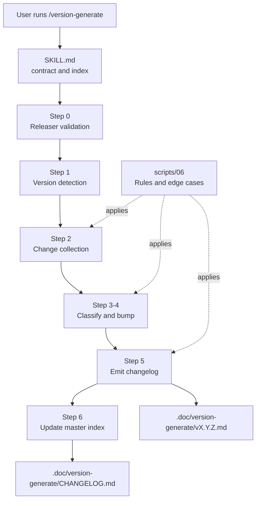
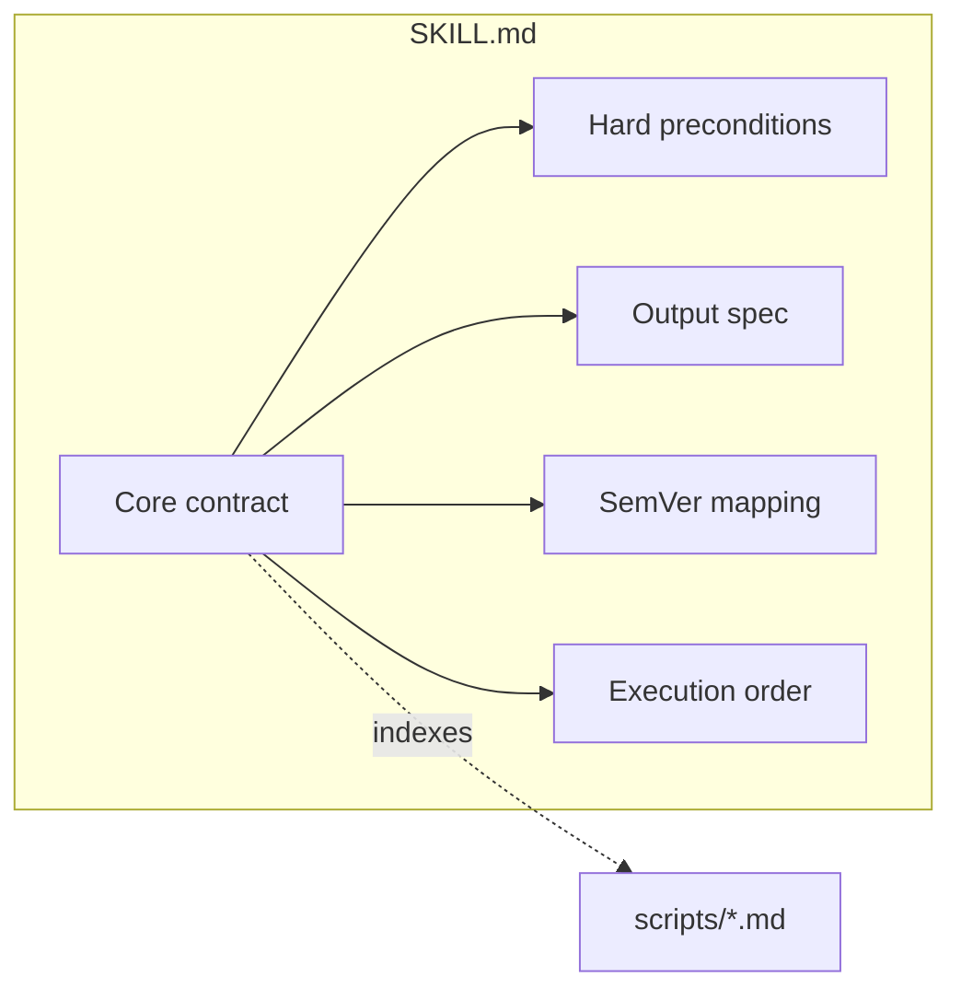
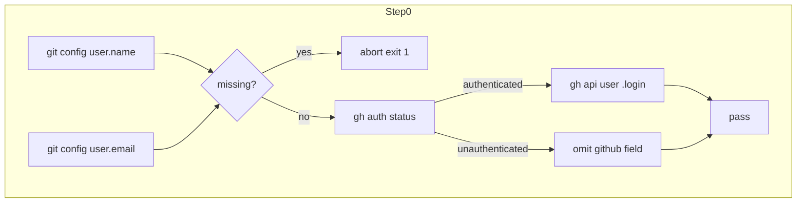
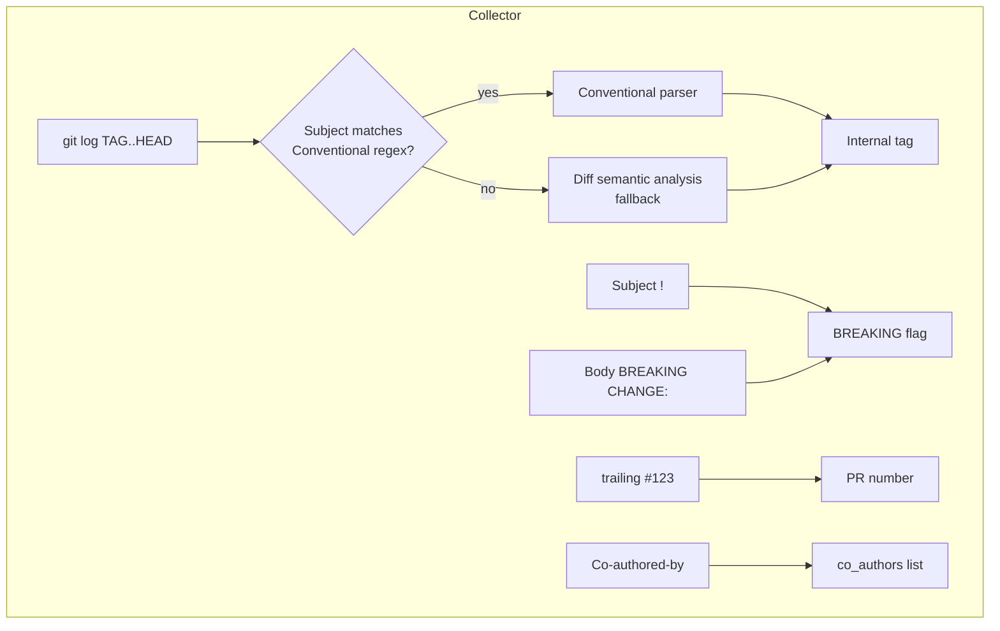
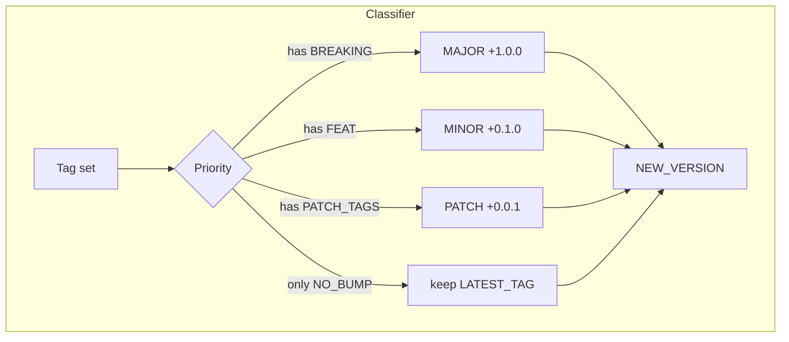
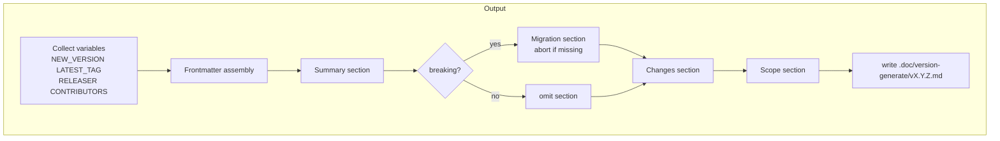
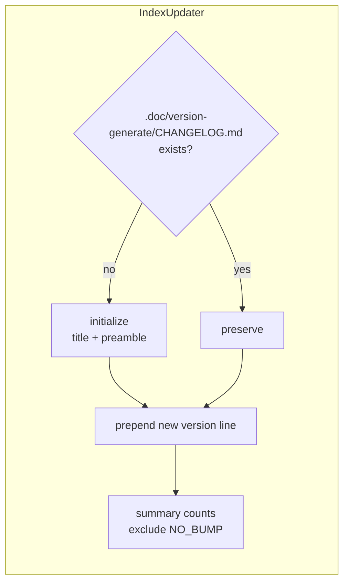
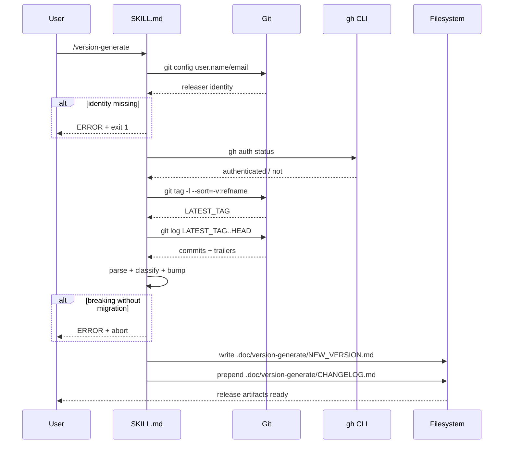
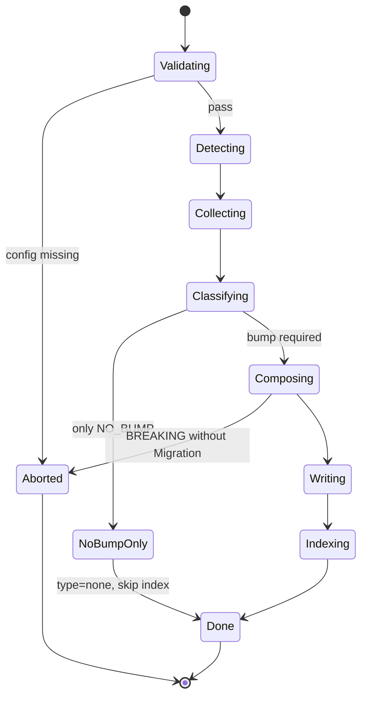

# skill-version-generate - Architecture

> Back to [README](../README.md)

## Overview

## Module: SKILL.md (contract layer)

Defines the workflow, hard preconditions, SemVer mapping, and execution order. Contains no implementation details; execution is delegated to `scripts/*.md`.

## Module: Step 0 — Releaser validation

## Module: Step 2 — Change collection (parser)

## Module: Step 3-4 — Classification and version bump

## Module: Step 5 — Output template

## Module: Step 6 — Master index maintenance

## Data Flow

## State Machine (release flow)

