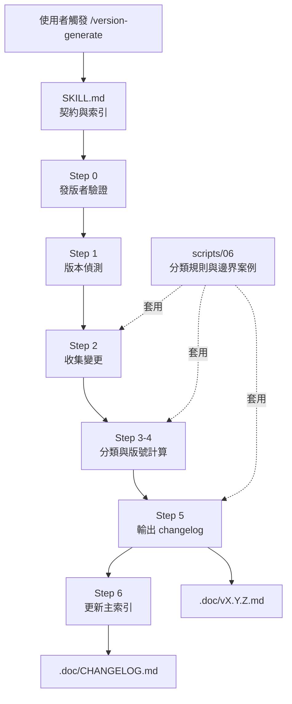
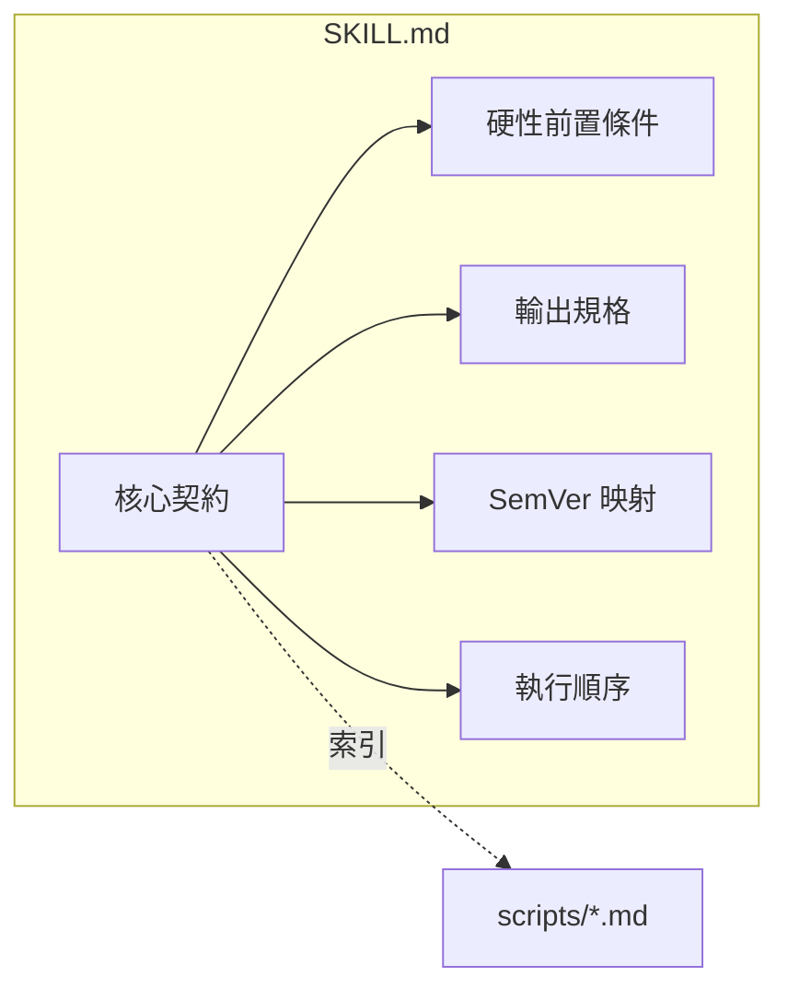
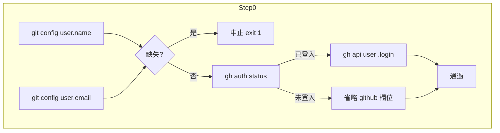
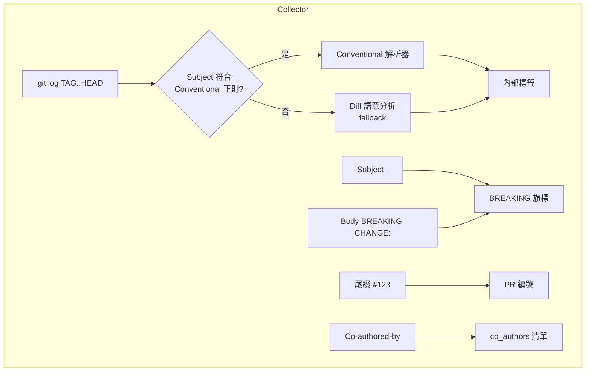
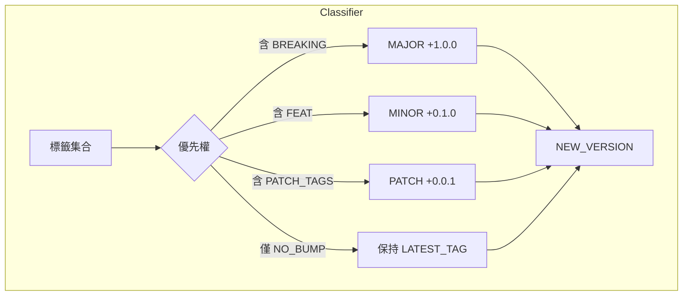
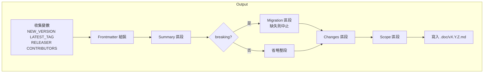
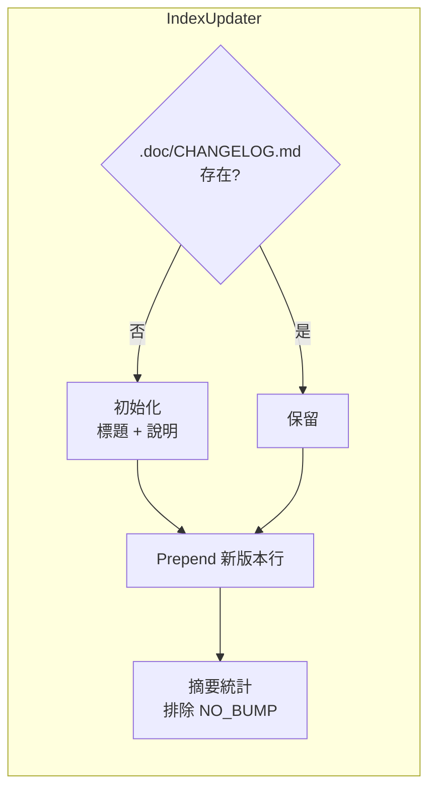
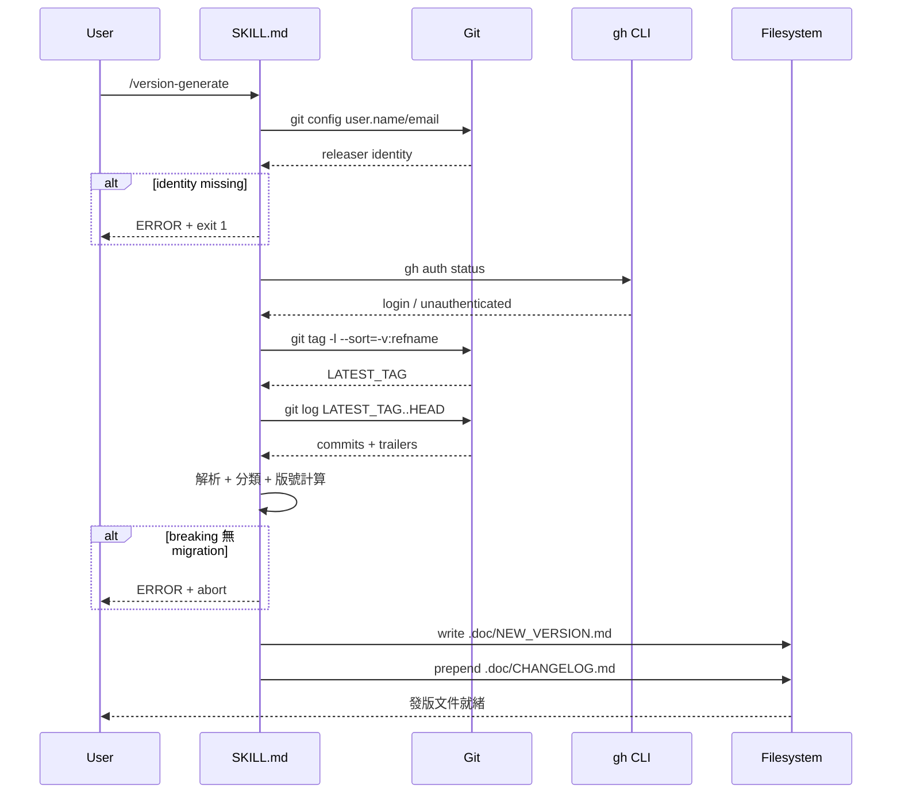
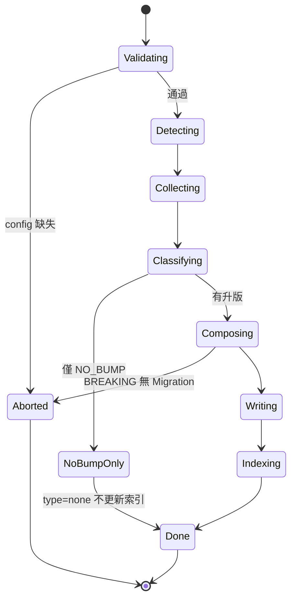

# skill-version-generate - 架構

> 返回 [README](./README.zh.md)

## 概覽

## Module: SKILL.md（契約層）

定義工作流程、硬性前置條件、SemVer 映射表與執行順序。不含實作細節，實作委派給 `scripts/*.md`。

## Module: Step 0 — 發版者驗證

## Module: Step 2 — 收集變更（解析器）

## Module: Step 3-4 — 分類與版號

## Module: Step 5 — 輸出模板

## Module: Step 6 — 主索引維護

## 資料流

## 狀態機（發版流程）

